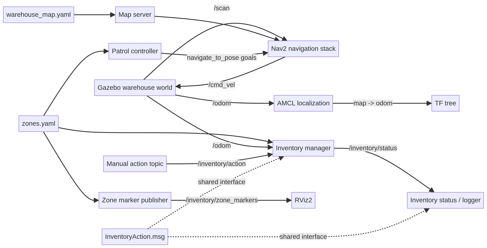
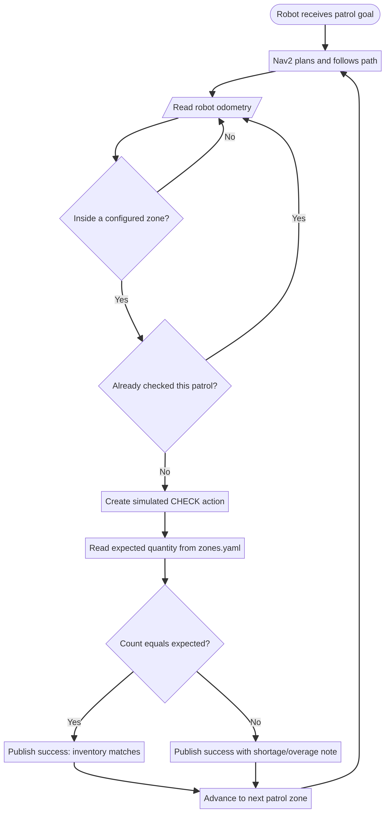

# Warehouse Inventory Robot (ROS 2 Humble)

This repository contains a ROS 2 warehouse inventory robot simulation project built with Gazebo and RViz.

## Project Overview

The robot patrols warehouse zones, publishes inventory actions, avoids obstacles using lidar, and updates zone stock through a custom inventory manager node.

## Repository Structure

```text
Warehouse_inventory_robot/
├── img/
│   ├── architecture.png
│   └── inventory_flow.png
└── warehouse_ws/
    └── src/
        └── warehouse_inventory_robot/
```

Main package path:

```text
warehouse_ws/src/warehouse_inventory_robot
```

Detailed package documentation:

- [`warehouse_ws/src/warehouse_inventory_robot/README.md`](warehouse_ws/src/warehouse_inventory_robot/README.md)

## Project Photos

### System Architecture



### Inventory Process Flow



## Quick Start

Run on Ubuntu 22.04 with ROS 2 Humble.

```bash
cd warehouse_ws
source /opt/ros/humble/setup.bash
colcon build --symlink-install
source install/setup.bash
ros2 launch warehouse_inventory_robot simulation.launch.py
```
