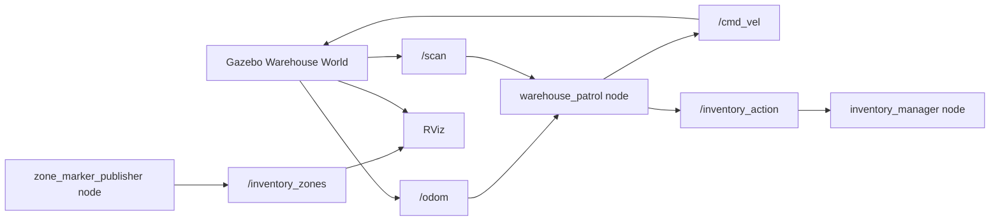
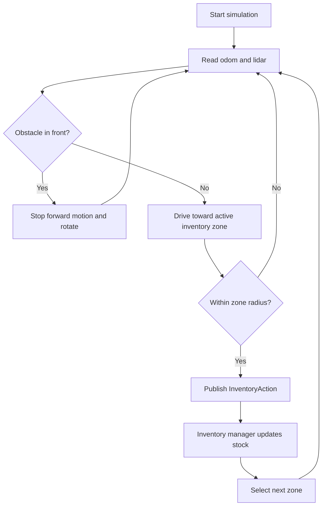

# Major Project - 1: Warehouse Inventory Robot

## 1. Introduction

Warehouse inventory checking is a repeated task that can be improved through mobile robotics. A robot can move through aisles, visit predefined stock zones, and report simulated pick-up, drop-off, or stock-check actions. This project demonstrates the concept using ROS 2, Gazebo, and RViz before extending it to real hardware.

## 2. Scope and Motivation

The scope of this project is to design a simulated warehouse robot that can:

- Navigate a warehouse-like environment.
- Detect when it reaches predefined inventory zones.
- Simulate inventory actions through ROS 2 messages.
- Visualize robot motion, lidar readings, and zones in RViz.

The motivation is to reduce manual inspection effort and show how autonomous warehouse workflows can be prototyped safely in simulation.

## 3. Materials and Tools Used

- Ubuntu 22.04
- ROS 2 Humble
- Gazebo Classic
- RViz2
- Python 3
- ROS 2 packages: `rclpy`, `geometry_msgs`, `nav_msgs`, `sensor_msgs`, `visualization_msgs`, `gazebo_ros`, `xacro`

## 4. System Architecture

## 5. Methodology

The simulation was created as a ROS 2 package with a Gazebo world, URDF robot model, Python control nodes, custom message, and launch files.

The warehouse world contains outer walls, two rack rows, a small obstacle, and four colored inventory zones. The robot is a differential-drive platform with lidar and odometry. The patrol node receives odometry and laser scan data, computes the heading toward the next zone, and publishes velocity commands. When the robot reaches a zone, it publishes an inventory action message.

## 6. Inventory Logic Flow

## 7. Problem-Solving Approach

### Collision Issues

The robot uses lidar data to detect objects in front of it. If an obstacle is closer than the safety threshold, the controller stops linear motion and rotates until the path clears.

### Path Adjustments

The warehouse zones are arranged around the rack rows so the robot must navigate aisle-like paths. Zone coordinates can be tuned in `warehouse_patrol.py` to change the route.

### Node Synchronization

The patrol node waits until odometry is received before publishing movement commands. Inventory actions are only published once per zone visit to avoid repeated stock updates.

## 8. Testing and Results

Recommended test checks:

- Launch Gazebo and confirm the warehouse world loads.
- Confirm the robot spawns at the center of the world.
- Confirm `/scan`, `/odom`, `/cmd_vel`, `/inventory_action`, and `/inventory_zones` are active.
- Confirm RViz displays the robot, lidar scan, TF, and zone markers.
- Confirm the robot visits zones A1, B2, C3, and D4.
- Confirm the inventory manager logs each action.

Expected result:

- Navigation accuracy should be within approximately 0.25 m of each zone.
- The robot should pause at each inventory zone for about 2 seconds.
- Inventory actions should appear in terminal logs and on the `/inventory_action` topic.

## 9. Evaluation Mapping

- Functionality: Robot navigates and recognizes inventory zones in simulation.
- Creativity: The world includes aisles, racks, colored zones, obstacle avoidance, and stock update behavior.
- Technical Accuracy: Uses ROS 2 nodes, topics, custom message, Gazebo plugins, and RViz markers.
- Documentation: README, report, launch files, and source comments are included.

## 10. Conclusion

This project demonstrates a warehouse inventory robot using ROS 2 and Gazebo. The robot navigates between inventory zones, avoids obstacles, and simulates stock checking, item pick-up, and drop-off actions. Future improvements can include Nav2 map-based path planning, QR-code or ArUco-tag recognition, real sensors, and deployment on a physical differential-drive robot.
